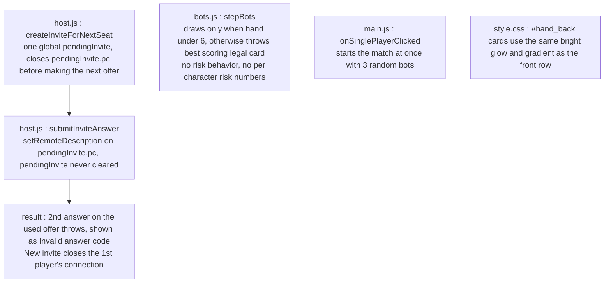
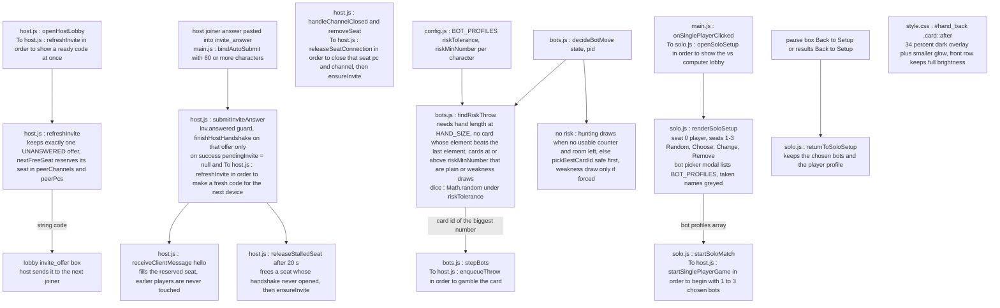

# Elemental Clash - before and after (bot risk throws, handshake fix, solo setup, dimmed back row)

Only the flows touched by this update are drawn.

## BEFORE

```mermaid
flowchart TD
  H1["host.js : createInviteForNextSeat<br/>one global pendingInvite, closes pendingInvite.pc before making the next offer"] --> H2["host.js : submitInviteAnswer<br/>setRemoteDescription on pendingInvite.pc, pendingInvite never cleared"]
  H2 --> H3["result : 2nd answer on the used offer throws, shown as Invalid answer code<br/>New invite closes the 1st player's connection"]
  B1["bots.js : stepBots<br/>draws only when hand under 6, otherwise throws best scoring legal card<br/>no risk behavior, no per character risk numbers"]
  S1["main.js : onSinglePlayerClicked<br/>starts the match at once with 3 random bots"]
  C1["style.css : #hand_back cards use the same bright glow and gradient as the front row"]
```

## AFTER

```mermaid
flowchart TD
  I0["host.js : openHostLobby<br/>To host.js : refreshInvite in order to show a ready code at once"] --> I1["host.js : refreshInvite<br/>keeps exactly one UNANSWERED offer, nextFreeSeat reserves its seat in peerChannels and peerPcs"]
  I1 -->|"string code"| I2["lobby invite_offer box<br/>host sends it to the next joiner"]
  I3["host joiner answer pasted into invite_answer<br/>main.js : bindAutoSubmit with 60 or more characters"] --> I4["host.js : submitInviteAnswer<br/>inv.answered guard, finishHostHandshake on that offer only<br/>on success pendingInvite = null and To host.js : refreshInvite in order to make a fresh code for the next device"]
  I4 --> I5["host.js : receiveClientMessage hello<br/>fills the reserved seat, earlier players are never touched"]
  I4 --> I6["host.js : releaseStalledSeat after 20 s<br/>frees a seat whose handshake never opened, then ensureInvite"]
  P1["host.js : handleChannelClosed and removeSeat<br/>To host.js : releaseSeatConnection in order to close that seat pc and channel, then ensureInvite"]
  K1["bots.js : decideBotMove state, pid"] --> K2["bots.js : findRiskThrow<br/>needs hand length at HAND_SIZE, no card whose element beats the last element, cards at or above riskMinNumber that are plain or weakness draws<br/>dice : Math.random under riskTolerance"]
  K2 -->|"card id of the biggest number"| K3["bots.js : stepBots<br/>To host.js : enqueueThrow in order to gamble the card"]
  K1 --> K4["no risk : hunting draws when no usable counter and room left, else pickBestCardId safe first, weakness draw only if forced"]
  C0["config.js : BOT_PROFILES riskTolerance, riskMinNumber per character"] --> K2
  O1["main.js : onSinglePlayerClicked<br/>To solo.js : openSoloSetup in order to show the vs computer lobby"] --> O2["solo.js : renderSoloSetup<br/>seat 0 player, seats 1-3 Random, Choose, Change, Remove<br/>bot picker modal lists BOT_PROFILES, taken names greyed"]
  O2 -->|"bot profiles array"| O3["solo.js : startSoloMatch<br/>To host.js : startSinglePlayerGame in order to begin with 1 to 3 chosen bots"]
  O4["pause box Back to Setup or results Back to Setup"] --> O5["solo.js : returnToSoloSetup<br/>keeps the chosen bots and the player profile"]
  D1["style.css : #hand_back .card::after<br/>34 percent dark overlay plus smaller glow, front row keeps full brightness"]
```
