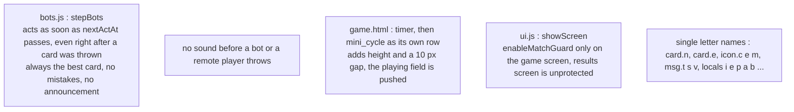
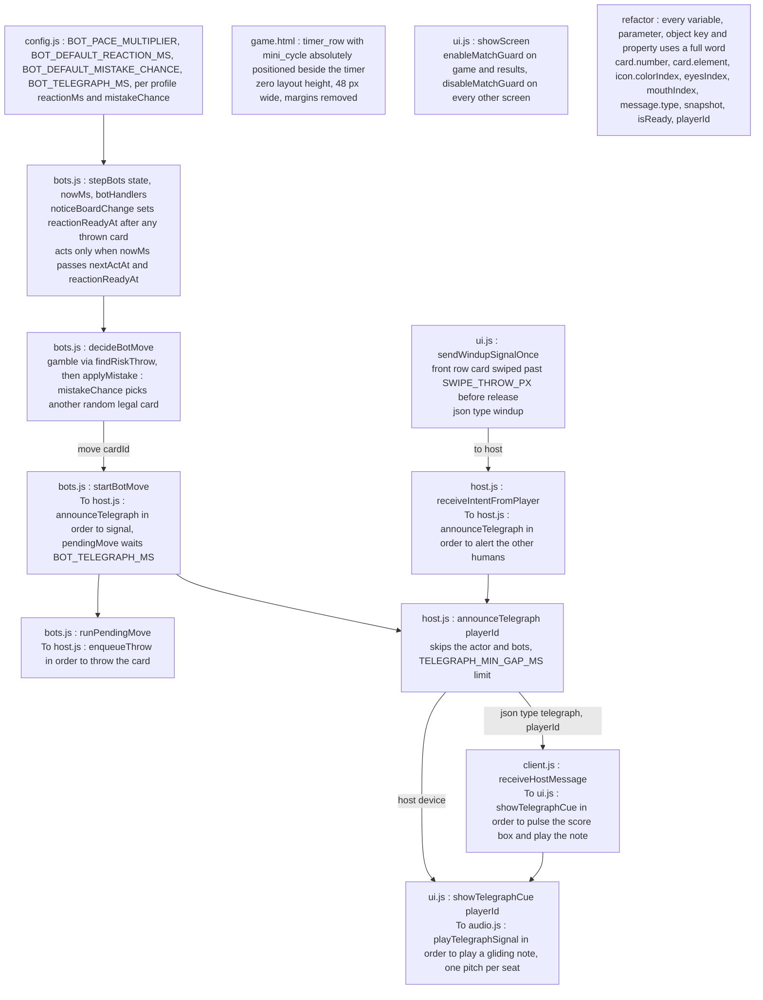

# Elemental Clash - before and after (bot friction, telegraph, mini diagram, naming, results guard)

Only the flows touched by this update are drawn.

## BEFORE

```mermaid
flowchart TD
  B1["bots.js : stepBots<br/>acts as soon as nextActAt passes, even right after a card was thrown<br/>always the best card, no mistakes, no announcement"]
  T1["no sound before a bot or a remote player throws"]
  M1["game.html : timer, then mini_cycle as its own row<br/>adds height and a 10 px gap, the playing field is pushed"]
  G1["ui.js : showScreen<br/>enableMatchGuard only on the game screen, results screen is unprotected"]
  N1["single letter names : card.n, card.e, icon.c e m, msg.t s v, locals i e p a b ..."]
```

## AFTER

```mermaid
flowchart TD
  C0["config.js : BOT_PACE_MULTIPLIER, BOT_DEFAULT_REACTION_MS, BOT_DEFAULT_MISTAKE_CHANCE, BOT_TELEGRAPH_MS, per profile reactionMs and mistakeChance"] --> B2
  B2["bots.js : stepBots state, nowMs, botHandlers<br/>noticeBoardChange sets reactionReadyAt after any thrown card<br/>acts only when nowMs passes nextActAt and reactionReadyAt"] --> B3["bots.js : decideBotMove<br/>gamble via findRiskThrow, then applyMistake : mistakeChance picks another random legal card"]
  B3 -->|"move cardId"| B4["bots.js : startBotMove<br/>To host.js : announceTelegraph in order to signal, pendingMove waits BOT_TELEGRAPH_MS"]
  B4 --> B5["bots.js : runPendingMove<br/>To host.js : enqueueThrow in order to throw the card"]
  H1["ui.js : sendWindupSignalOnce<br/>front row card swiped past SWIPE_THROW_PX before release<br/>json type windup"] -->|"to host"| H2["host.js : receiveIntentFromPlayer<br/>To host.js : announceTelegraph in order to alert the other humans"]
  B4 --> H3["host.js : announceTelegraph playerId<br/>skips the actor and bots, TELEGRAPH_MIN_GAP_MS limit"]
  H2 --> H3
  H3 -->|"json type telegraph, playerId"| H4["client.js : receiveHostMessage<br/>To ui.js : showTelegraphCue in order to pulse the score box and play the note"]
  H3 -->|"host device"| H5["ui.js : showTelegraphCue playerId<br/>To audio.js : playTelegraphSignal in order to play a gliding note, one pitch per seat"]
  H4 --> H5
  U1["game.html : timer_row with mini_cycle absolutely positioned beside the timer<br/>zero layout height, 48 px wide, margins removed"]
  G1["ui.js : showScreen<br/>enableMatchGuard on game and results, disableMatchGuard on every other screen"]
  N1["refactor : every variable, parameter, object key and property uses a full word<br/>card.number, card.element, icon.colorIndex, eyesIndex, mouthIndex, message.type, snapshot, isReady, playerId"]
```
