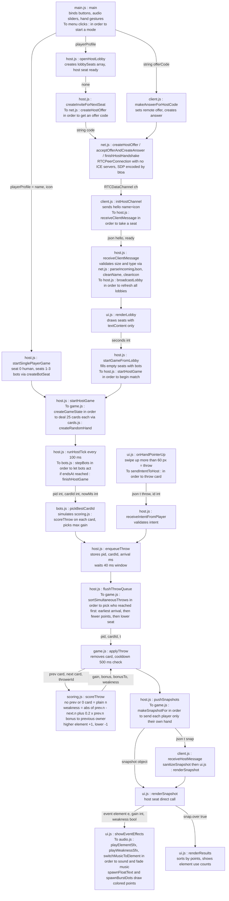

# Elemental Clash - code flow (built from scratch)

```mermaid
flowchart TD
  M["main.js : main<br/>binds buttons, audio sliders, hand gestures<br/>To menu clicks : in order to start a mode"]
  M -->|"playerProfile = name, icon"| SP["host.js : startSinglePlayerGame<br/>seat 0 human, seats 1-3 bots via createBotSeat"]
  M -->|"playerProfile"| LB["host.js : openHostLobby<br/>creates lobbySeats array, host seat ready"]
  M -->|"string offerCode"| CL["client.js : makeAnswerForHostCode<br/>sets remote offer, creates answer"]
  LB -->|"none"| INV["host.js : createInviteForNextSeat<br/>To net.js : createHostOffer in order to get an offer code"]
  INV -->|"string code"| NET["net.js : createHostOffer / acceptOfferAndCreateAnswer / finishHostHandshake<br/>RTCPeerConnection with no ICE servers, SDP encoded by btoa"]
  CL --> NET
  NET -->|"RTCDataChannel ch"| CH["client.js : initHostChannel<br/>sends hello name+icon<br/>To host.js : receiveClientMessage in order to take a seat"]
  CH -->|"json hello, ready"| RCM["host.js : receiveClientMessage<br/>validates size and type via net.js : parseIncomingJson, cleanName, cleanIcon<br/>To host.js : broadcastLobby in order to refresh all lobbies"]
  RCM --> LB2["ui.js : renderLobby<br/>draws seats with textContent only"]
  LB2 -->|"seconds int"| SG["host.js : startGameFromLobby<br/>fills empty seats with bots<br/>To host.js : startHostGame in order to begin match"]
  SP --> SH
  SG --> SH["host.js : startHostGame<br/>To game.js : createGameState in order to deal 25 cards each via cards.js : createRandomHand"]
  SH --> TICK["host.js : runHostTick every 100 ms<br/>To bots.js : stepBots in order to let bots act<br/>if endsAt reached : finishHostGame"]
  TICK -->|"pid int, cardId int, nowMs int"| BOT["bots.js : pickBestCardId<br/>simulates scoring.js : scoreThrow on each card, picks max gain"]
  BOT --> Q
  UI["ui.js : onHandPointerUp<br/>swipe up more than 60 px = throw<br/>To sendIntentToHost : in order to throw card"] -->|"json t throw, id int"| RIP["host.js : receiveIntentFromPlayer<br/>validates intent"]
  RIP --> Q["host.js : enqueueThrow<br/>stores pid, cardId, arrival ms<br/>waits 40 ms window"]
  Q --> FL["host.js : flushThrowQueue<br/>To game.js : sortSimultaneousThrows in order to pick who reached first: earliest arrival, then fewer points, then lower seat"]
  FL -->|"pid, cardId, t"| AT["game.js : applyThrow<br/>removes card, cooldown 500 ms check"]
  AT -->|"prev card, next card, throwerId"| SC["scoring.js : scoreThrow<br/>no prev or 0 card = plain n<br/>weakness = abs of prev.n - next.n plus 0.2 x prev.n bonus to previous owner<br/>higher element +1, lower -1"]
  SC -->|"gain, bonus, bonusTo, weakness"| AT
  AT --> PS["host.js : pushSnapshots<br/>To game.js : makeSnapshotFor in order to send each player only their own hand"]
  PS -->|"snapshot object"| RS["ui.js : renderSnapshot<br/>host seat direct call"]
  PS -->|"json t snap"| RHM["client.js : receiveHostMessage<br/>sanitizeSnapshot then ui.js : renderSnapshot"]
  RHM --> RS
  RS -->|"event element e, gain int, weakness bool"| FX["ui.js : showEventEffects<br/>To audio.js : playElementSfx, playWeaknessSfx, switchMusicToElement in order to sound and fade music<br/>spawnFloatText and spawnBurstDots draw colored points"]
  RS -->|"snap.over true"| RES["ui.js : renderResults<br/>sorts by points, shows element use counts"]
```
